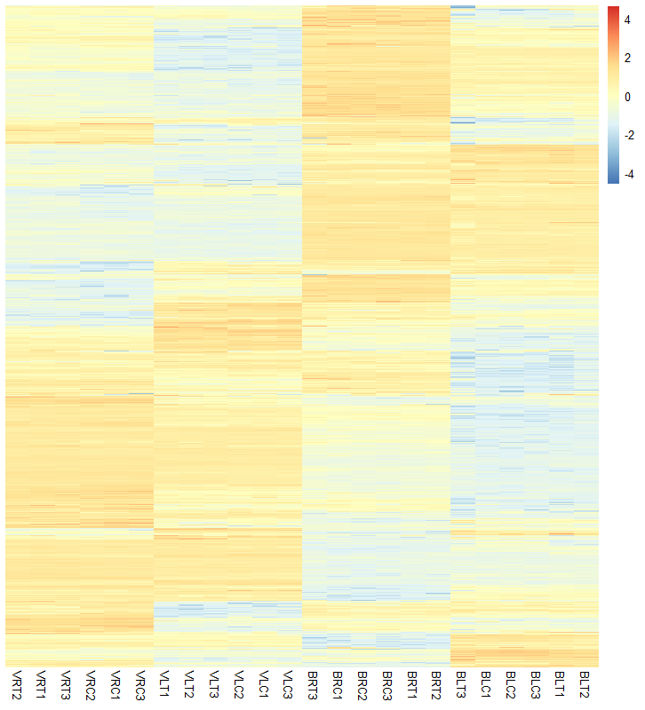

# Solutions to Problem Set

### Interpreters:
- Python 3.9.7 
- R 4.1.1

## Task 1

### Packages used:
- #### Python
  - Biopython 1.79
  - Numpy 1.21.2
  - Pandas 1.3.4
  - Scikit-learn 1.0

### Rarest amino acid
The protein sequences (translated CDSs) fasta file is downloaded from RAP-DB and renamed as `RAP-DB_protein.fasta`.`aminocount.py` is run. The code first reads the file and removes the description lines, then counting the remaining characters in the string. Next, the file pointer is reset and the file is read again as a list of `Seq` objects. The process of counting the letters is repeated for each individual sequence. The count data are stored in lists.

The terminal output is as follows:
```
[('A', 1335216), ('L', 1334133), ('S', 1157441), ('G', 1063243), ('V', 968510), ('R', 937760),
 ('E', 831377), ('P', 810709), ('D', 752248), ('T', 663129), ('K', 662995), ('I', 605489),
 ('F', 508690), ('N', 481450), ('Q', 475649), ('H', 362638), ('Y', 355254), ('M', 333681),
 ('C', 267310), ('W', 181701), ('X', 767)]
```
**Since 'W' has the least count of amino acids, thus the rarest amino acid in rice is tryptophan.** In addition, a CSV file containing the counts of amino acids in each protein sequence is generated, named `RAP-DB_protein.csv`.

### Linear model for the most abundant amino acid
From the previous output, 'A' is has the highest count, which corresponds to alanine. `alaninemodel.py` is executed, which reads the first three columns of the CSV file. Using `LinearRegression` class, a model is created for alanine. The details of the model are:
```
Coefficient of Determination: 0.6691413471242633
Slope: 0.0883266653288367
Equation:  AlanineCount = 0.088327(Length)
```


Next, the list of lengths is iterated over to predict the alanine count and the difference between the actual and predicted count is used to find the protein with the maximum deviation:
```
Protein with maximum deviation:
Id: Os01t0356800-00  Length: 5342  Actual Count: 222  Predicted Count: 471.8410461866457
```

### Bonus: Most robust linear model

`aminoacidmodel.py` is run, which iterates over the count columns in the CSV and fits a linear model against length for each amino acid. The coefficients of determination for each amino acid are:
```
[('L', 0.843948908407366), ('D', 0.8357934114374416), ('V', 0.8266435180123104), ('T', 0.8244017077607064),
 ('S', 0.8116226368876596), ('I', 0.7621434432817498), ('E', 0.7510679085567628), ('F', 0.7391710974252289),
 ('N', 0.7327697148330172), ('G', 0.7244951681358109), ('M', 0.7229005377839433), ('K', 0.6983392058406741),
 ('Q', 0.6879440629053226), ('A', 0.6691413471242633), ('Y', 0.666326285073166), ('H', 0.6304158786503129),
 ('R', 0.6116589716142309), ('P', 0.6008657752033808), ('C', 0.48811048863430473), ('W', 0.48081493395348185),
 ('X', 6.482643950156408e-05)]
```
**As 'L' has the greatest coefficient, Leucine gives the most robust linear model.**

---
## Task 2

### Packages used:
- #### Python
  - Biopython 1.79

The genbank file is downloaded and renamed as `U00096.3.gb` and `cds.py` is run. The file is parsed as a `Seq` object, and the collection of `SeqFeature` objects are iterated over. The objects with `feature.type` set as `CDS` are stored as a list of `Seq` objects, which is then written in `U00096.3_cds.fasta`.

---
## Task-3

The sequence of the two-pore potassium channel is obtained from RAP-DB. The id of the gene is used to run a strict search for sgRNA in [E-CRISP](http://www.e-crisp.org/E-CRISP/index.html). The output tab file is downloaded and the topmost choice is selected.

|Name					|TPKA_1_1548	|
|-----------------------|---------------|
|Length					|23	|
|Start					|1810	|
|End					|1833	|
|Strand					|plus	|
|Nucleotide sequence	|GGCTTCCGCTGCAGCACATT NGG	|
|%A %C %T %G			|16 28 24 32	|
|S-Score				|100	|
|A-Score				|58.3333	|
|E-Score				|46.5050	|
|Number of Hits			|1	|
|Direction				|fw	|
|CDS_score				|0	|
|Exon_Score				|0	|
|seed_GC				|0.4	|
|Doench_Score			|0.0138998335896085	|
|Xu_score				|-0.088648902	|
|Chromosome				|3	|
|Genomic start			|31016142	|
|Genomic End			|31016165	|

The sequence is converted to RNA and the constant tracrRNA is appended at the end:

**RNA sequence:** GGCUUCCGCUGCAGCACAUU NGG

**tracrRNA:** GUUUUAGAGCUAGAAAUAGCAAGUUAAAAUAAGGCUAGUCCGUUAUCAACUUGAAAAAGUGGCACCGAGUCGGUGCUUUUUU

**The final sgRNA is:** GGCUUCCGCUGCAGCACAUU NGG GUUUUAGAGCUAGAAAUAGCAAGUUAAAAUAAGGCUAGUCCGUUAUCAACUUGAAAAAGUGGCACCGAGUCGGUGCUUUUUU

---
## Task-4

### Packages used:
- #### R
  - pacman
  - rio
  - DESeq2
  - apeglm
  - ggplot2
  - pheatmap

The excel file is converted into a CSV of raw read counts. DESeq2 is used to find differentially expressed genes between the different conditions at a significance level of 0.01. The summary of the results of DESeq is:
```
out of 30210 with nonzero total read count
adjusted p-value < 0.01
LFC > 0 (up)       : 2484, 8.2%
LFC < 0 (down)     : 3113, 10%
outliers [1]       : 206, 0.68%
low counts [2]     : 1170, 3.9%
(mean count < 2)
```
The list of differentially expressed genes is written in `DEgenes.csv`. The produced heatmap from the normalized read counts is:


